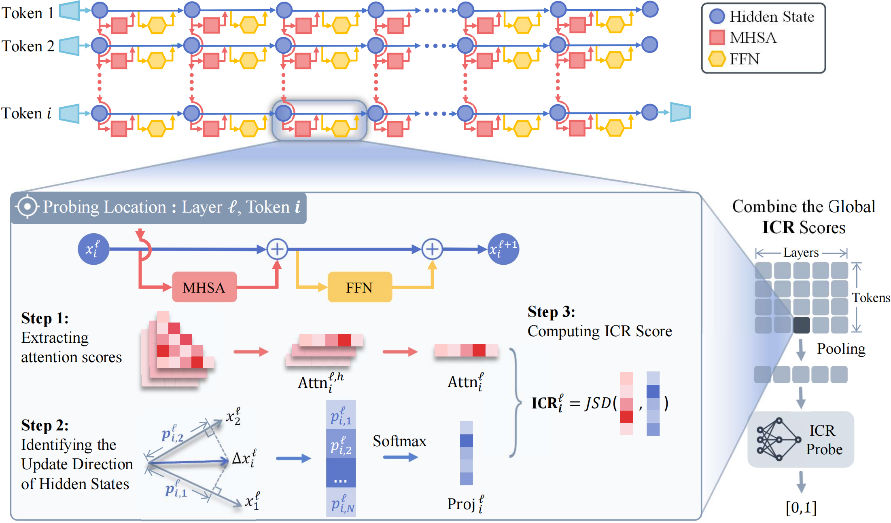

# 🔬 ICR Probe

<p align="center">
  <a href="https://aclanthology.org/2025.acl-long.880/"></a>
  <a href="https://arxiv.org/abs/2507.16488"></a>
  <a href="LICENSE"></a>
</p>

<h3 align="center">Tracking Hidden State Dynamics for Reliable Hallucination Detection in LLMs</h3>

<p align="center">
  
</p>

## 📖 Overview

Large language models (LLMs) tend to generate hallucinations that undermine their reliability. We introduce the **ICR Score** (**I**nformation **C**ontribution to **R**esidual Stream), a metric quantifying module contributions to hidden state updates. Building on this, we propose **ICR Probe**, which captures cross-layer hidden state evolution for hallucination detection, achieving superior performance with fewer parameters.

## 🚀 Quick Start

**1. Compute ICR Scores**

```python
from src.icr_score import ICRScore

icr_calculator = ICRScore(
    hidden_states=hidden_states,  # list[output_size+1, layer, batch](seq_len, dim)
    attentions=attentions,         # list[output_size+1, layer, batch](n_head, seq_len, seq_len)
    skew_threshold=0,
    entropy_threshold=1e5,
    core_positions={
        'user_prompt_start': start_position,
        'user_prompt_end': end_position,
        'response_start': response_start_position,
    },
    icr_device='cuda'
)

icr_scores, top_p_mean = icr_calculator.compute_icr(
    top_k=20, top_p=0.1, pooling='mean',
    attention_uniform=False, hidden_uniform=False, use_induction_head=True
)
```

**2. Train ICR Probe**

> **Note**: The following code is for illustration only. You need to adapt the training code to your own hardware setup and training framework.

```python
from src.icr_probe import ICRProbeTrainer
from src.config import Config

trainer = ICRProbeTrainer(
    train_loader=train_loader,
    val_loader=val_loader,
    config=Config.from_args()
)
trainer.setup_data()
trainer.setup_model()
trainer.train()
```

**3. Empirical Study**: See `scripts/empirical_study.ipynb`

## 📁 Project Structure

```
├── src/
│   ├── icr_score.py      # ICR Score computation
│   ├── icr_probe.py      # Probe trainer
│   ├── utils.py          # MLP model
│   └── config.py         # Configuration
├── scripts/
│   └── empirical_study.ipynb
└── figure/
```

## 📚 Citation

```bibtex
@inproceedings{zhang-etal-2025-icr,
    title     = {ICR Probe: Tracking Hidden State Dynamics for Reliable Hallucination Detection in LLMs},
    author    = {Zhang, Zhenliang and Hu, Xinyu and Zhang, Huixuan and Zhang, Junzhe and Wan, Xiaojun},
    booktitle = {Proceedings of the 63rd Annual Meeting of the Association for Computational Linguistics (Volume 1: Long Papers)},
    month     = jul,
    year      = {2025},
    address   = {Vienna, Austria},
    publisher = {Association for Computational Linguistics},
    pages     = {17986--18002},
    url       = {https://aclanthology.org/2025.acl-long.880/},
    doi       = {10.18653/v1/2025.acl-long.880}
}
```

## 📄 License

MIT License
