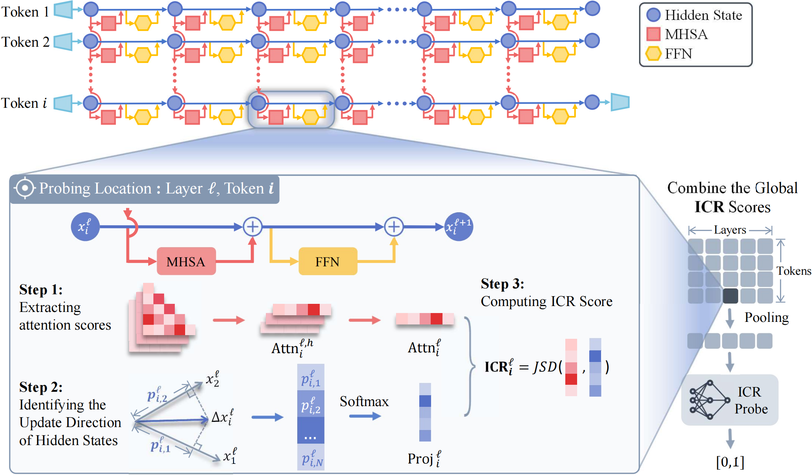

# ICR Probe
[ACL 2025] ICR Probe: Tracking Hidden State Dynamics for Reliable Hallucination Detection in LLMs
### Abstract
Large language models (LLMs) excel at various natural language processing tasks, but their tendency to generate hallucinations undermines their reliability. Existing hallucination detection methods leveraging hidden states predominantly focus on static and isolated representations, overlooking their dynamic evolution across layers, which limits efficacy. To address this limitation, we shift the focus to the hidden state update process and introduce a novel metric, the **ICR** Score (**I**nformation **C**ontribution to **R**esidual Stream), which quantifies the contribution of modules to the hidden states' update. We empirically validate that the ICR Score is effective and reliable in distinguishing hallucinations. Building on these insights, we propose a hallucination detection method, the ICR Probe, which captures the cross-layer evolution of hidden states. Experimental results show that the ICR Probe achieves superior performance with significantly fewer parameters. Furthermore, ablation studies and case analyses offer deeper insights into the underlying mechanism of this method, improving its interpretability.




Overview of the ICR Score computation and ICR Probe detection process.

### Usage
To use the ICR Probe for hallucination detection, follow these steps:
1. **Compute ICR Scores**: Use the provided code to compute the ICR Scores for your model and dataset.

```python
import torch
from src.icr_score import ICRScore

# -----------------------------------------------------------
# Assume you have already run a forward pass and cached:
#   • hidden_states: list[output_size+1, layer, batch](seq_len/1, dim)
#   • attentions:    list[output_size+1, layer, batch](n_head, seq_len, seq_len)
# -----------------------------------------------------------
hidden_states = [...] 
attentions = [...] 

# Initialize ICR Score calculator
icr_calculator = ICRScore(
    hidden_states=hidden_states,
    attentions=attentions,
    # Parameters for Induction Head, but not used in the final version
    skew_threshold=0,  # Threshold for skewness, set to 0 if not needed
    entropy_threshold=1e5, # Threshold for entropy, set to 1e5 if not needed
    core_positions={
        'user_prompt_start': start_position,  
        'user_prompt_end': end_position,  
        'response_start': response_start_position,  
    },
    icr_device='cuda'
)

# Compute ICR scores with config
icr_scores, top_p_mean = icr_calculator.compute_icr(
    top_k=20,
    top_p=0.1, 
    pooling='mean',
    attention_uniform=False,
    hidden_uniform=False,
    use_induction_head=True
)

# ... Save ICR scores ...
```
2. **Empirical study**: Use the computed ICR Scores to analyze and visualize the model's behavior, focusing on how different layers contribute to the hidden state updates. `scripts/empirical_study.ipynb` provides a notebook for analysis.

3. **ICR Probe for Hallucination Detection**: Implement the ICR Probe using the computed ICR Scores to detect hallucinations in your model's outputs.

```python
from src.icr_probe import ICRProbeTrainer

# ... Assuming we have the ICR scores and other necessary data ...
train_loader, val_loader = ...  # Load your ICR scores 
config = Config.from_args()
    
trainer = ICRProbeTrainer(
    train_loader=train_loader,
    val_loader=val_loader,
    config=config,
)
trainer.setup_data()
trainer.setup_model()
trainer.train()
```


